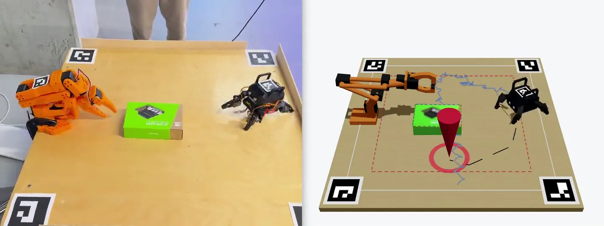

# Spidey & Armie

[](docs/demo.mp4)

A live 3D reconstruction of a tabletop arena that steers a real robot. An overhead camera tracks a Sesame quadruped, an SO-101 arm and every object on the table. Click anywhere in the 3D view, or say where to go, and the real robot walks there. When obstacles block every path, the arm picks the robot up and carries it past them.

Built at Hack the North 2026 by Angus Sun, Adam Zaw, Arjun Virk and Sean Yang. [Devpost](https://devpost.com/software/rob-s-bot)

## How it works

| Part | What it does | Where |
|---|---|---|
| Robot | Sesame quadruped on an ESP32-S2. Gaits and poses over WebSocket. | `firmware/` |
| Camera | C++ ArUco tracker on a QNX Raspberry Pi. Streams the robot's pose at about 30 fps. | `pi/` |
| Objects | MobileSAM detection. New objects reach the map in under a second. | `vision/` |
| Navigation | Kalman-filtered pose, Dijkstra on a 2 cm grid, stuck recovery, and a carry request to the arm when no path exists. | `bridge/` |
| Arm | SO-101 with closed-form IK, hard safety limits, and a grip planned from the robot's tag. | `arm/` |
| Interface | React and three.js 3D and 2D maps, a hardware-free simulator, and voice through Whisper and an LLM on Groq. | `src/` |

`nav/` is an earlier camera-only navigator, and `docs/HANDOFF.md` is the message format between the bridge and the web app.

## Running it

```sh
npm install && npm run dev   # web app on :5173; pick a mock scenario to run the simulator with no hardware
sh pi/live.sh                # live system: bridge, object detection, web app and the Pi tracker
sh run.sh                    # arm commands; sh run.sh test checks the arm maths offline
```

Voice control needs `GROQ_API_KEY` in `bridge/.env` (copy `bridge/.env.example`).
